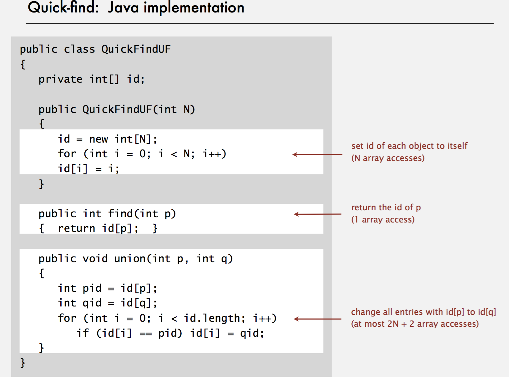
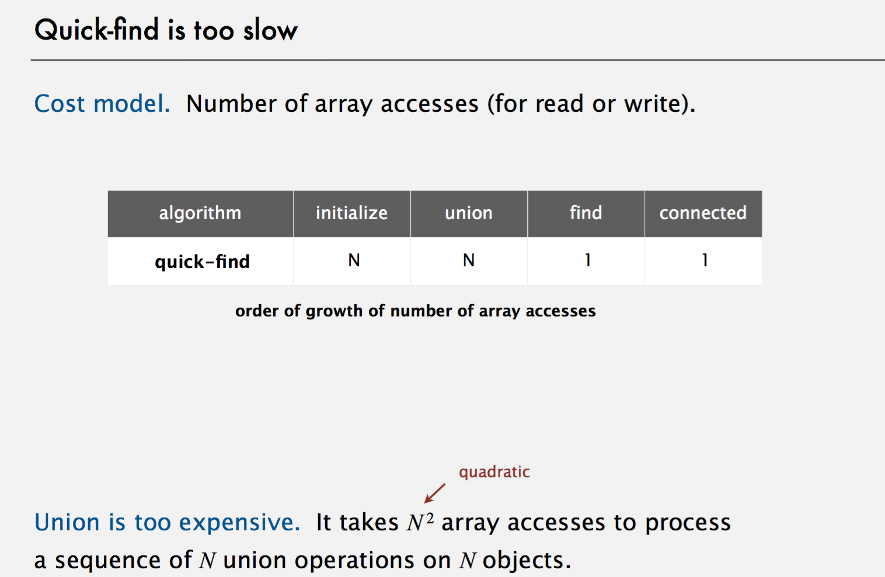
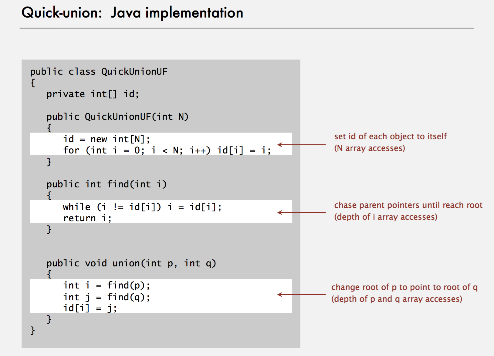
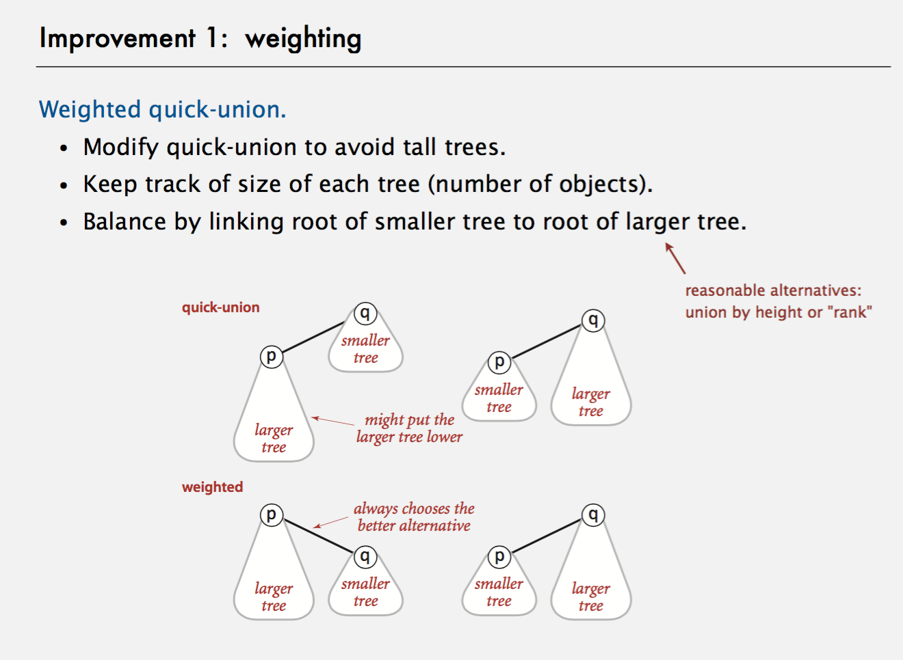
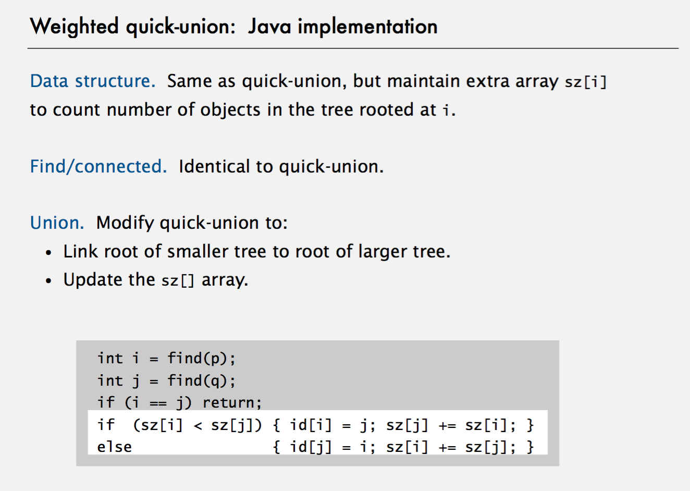
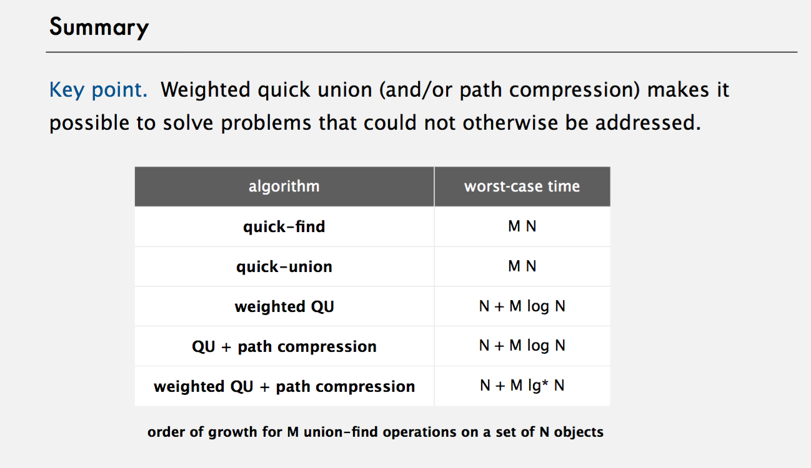

##Union Find

###Basic Java Model
优化前合并与查找时间复杂度都是O(n)
Compressed path优化后 都是O(1)
union find不支持删除操作


```java
/*
用数组或者hashmap都可以
 */
HashMap<Integer, Integer> hashmap = new HashMap<Integer, Integer>();
int find(int x) {
	int root = hashmap.get(x);
	/*
	当没找到自己是根节点的时候,就继续深度遍历进入曾祖父找,直到找到最后的根节点
	 */
	while (root != hashmap.get(root)) {
		root = hasmap.get(root);
	}
	return root;
}

void union(int x, int y) {
	int root_x = find(x);
	int root_y = find(y);
	if (root_x != root_y) {
		hashmap.put(root_x, root_y);
	}
}

int compressed_find(int x) {
	int root = hashmap.get(x);
	while (root != hashmap.get(root)) {
		root = hashmap.get(root);
	}
	int temp = -1;
	int cur = x;
	while (cur != hashmap.get(cur)) {
		temp = hashmap.get(cur);
		hashmap.put(cur, root);
		cur = temp;
	}
	return root;
}
```

###课件参考




###Better Solution
#### just change the root of p to q, not every element to q



###Still two ways to better to improve
#### 1: Weighted quick-union




#### 2: Path Compression


####Summary

