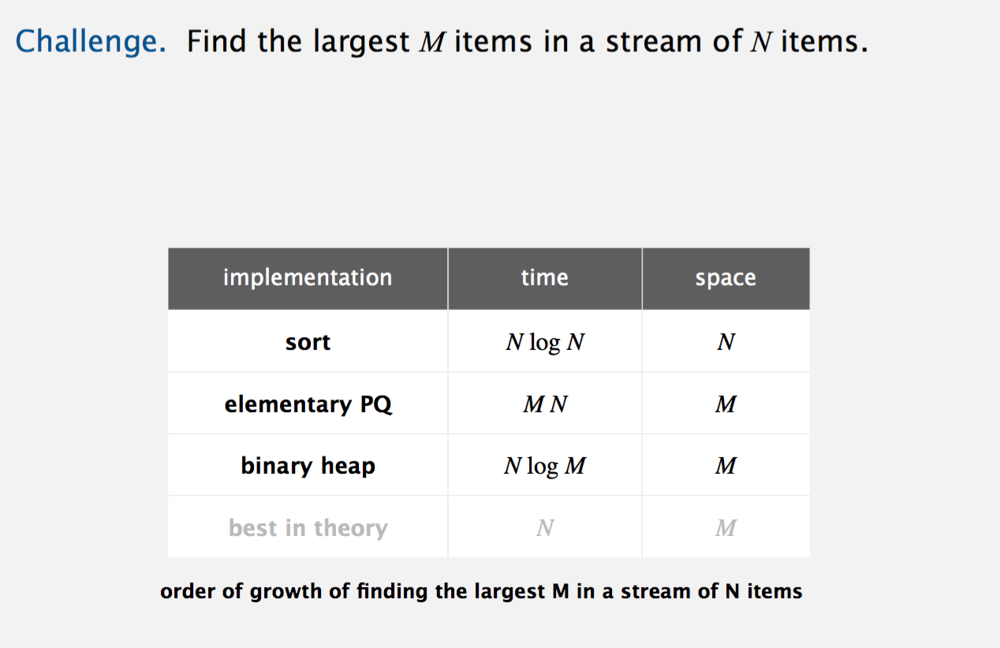

# Heap - 堆

一般情况下，堆通常指的是**二叉堆**，**二叉堆**是一个近似**完全二叉树**的数据结构，**即披着二叉树羊皮的数组，**故使用数组来实现较为便利。子结点的键值或索引总是小于（或者大于）它的父节点，且每个节点的左右子树又是一个**二叉堆**(大根堆或者小根堆)。根节点最大的堆叫做最大堆或大根堆，根节点最小的堆叫做最小堆或小根堆。**常被用作实现优先队列。**

- PriorityQueue provides O(log(n)) time for the enqueing and dequeing methods (offer, poll, remove() and add); linear time for the remove(Object) and contains(Object) methods

## 特点

1. **以数组表示，但是以完全二叉树的方式理解**。
2. 唯一能够同时最优地利用空间和时间的方法——最坏情况下也能保证使用 $$2N \log N$$ 次比较和恒定的额外空间。
3. 在索引从0开始的数组中：
  - 父节点 `i` 的左子节点在位置`(2*i+1)`
  - 父节点 `i` 的右子节点在位置`(2*i+2)`
  - 子节点 `i` 的父节点在位置`floor((i-1)/2)`

## 堆的基本操作

以大根堆为例，堆的常用操作如下。

1. 最大堆调整（Max_Heapify）：将堆的末端子节点作调整，使得子节点永远小于父节点
2. 创建最大堆（Build_Max_Heap）：将堆所有数据重新排序
3. 堆排序（HeapSort）：移除位在第一个数据的根节点，并做最大堆调整的递归运算

其中步骤1是给步骤2和3用的。

