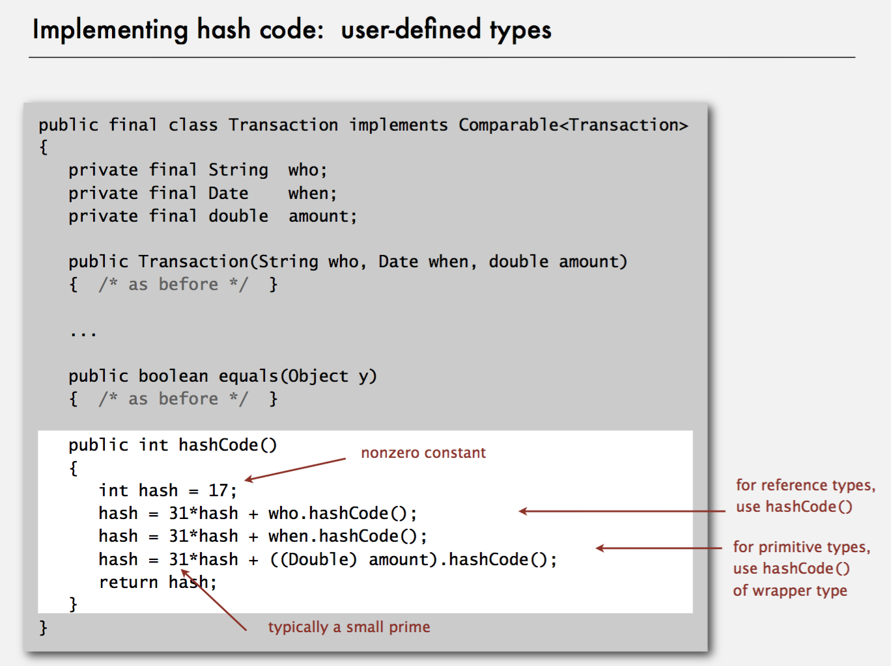

# Map - 哈希表

Map 是一种关联数组的数据结构，也常被称为字典或键值对。

####User Define Hash

####String Hash

####Chaining Hash


## 编程实现

### Java

Java 的实现中 Map 是一种将对象与对象相关联的设计。常用的实现有`HashMap`和`TreeMap`, `HashMap`被用来快速访问，而`TreeMap`则保证『键』始终有序。Map 可以返回键的 Set, 值的 Collection, 键值对的 Set.

```java
Map<String, Integer> map = new HashMap<String, Integer>();
map.put("bill", 98);
map.put("ryan", 99);
boolean exist = map.containsKey("ryan"); // check key exists in map
int point = map.get("bill"); // get value by key
int point = map.remove("bill") // remove by key, return value
Set<String> set = map.keySet();
// iterate Map
for (Map.Entry<String, Integer> entry : map.entrySet()) {
    String key = entry.getKey();
    int value = entry.getValue();
    // do some thing
}
```
