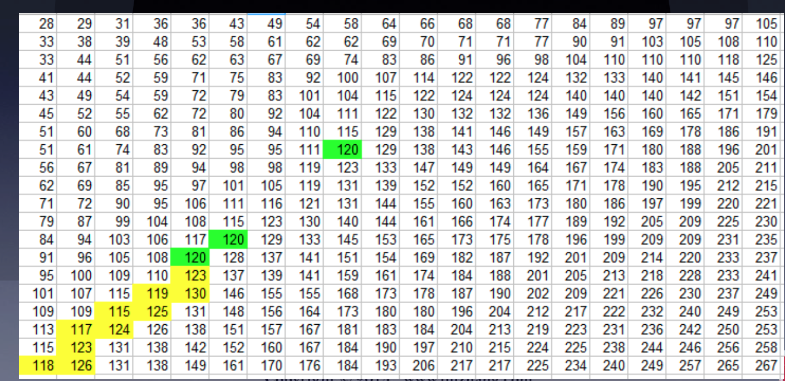

##Search a 2D Matrix II

30% Accepted

	Write an efficient algorithm that searches for a value in an m x n matrix, return the occurrence of it.

	This matrix has the following properties:

	    * Integers in each row are sorted from left to right.

	    * Integers in each column are sorted from up to bottom.

	    * No duplicate integers in each row or column.

	Have you met this question in a real interview? Yes
	Example
	Consider the following matrix:

	[

	    [1, 3, 5, 7],

	    [2, 4, 7, 8],

	    [3, 5, 9, 10]

	]

	Given target = 3, return 2.

####Challenge
- O(m+n) time and O(1) extra space

####Tags Expand
- Matrix

####思路
- 非常精妙的解法
- 根据其特殊的性质，不再使用二分





```java
public class Solution {
    /**
     * @param matrix: A list of lists of integers
     * @param: A number you want to search in the matrix
     * @return: An integer indicate the occurrence of target in the given matrix
     */
    public int searchMatrix(int[][] matrix, int target) {
        // check corner case
        if (matrix == null || matrix.length == 0) {
            return 0;
        }
        if (matrix[0] == null || matrix[0].length == 0) {
            return 0;
        }

        // from bottom left to top right
        int n = matrix.length;
        int m = matrix[0].length;
        int x = n - 1;
        int y = 0;
        int count = 0;

        while (x >= 0 && y < m) {
            if (matrix[x][y] < target) {
                y++;
            } else if (matrix[x][y] > target) {
                x--;
            } else {
                count++;
                x--;
                y++;
            }
        }
        return count;
    }
}
```


